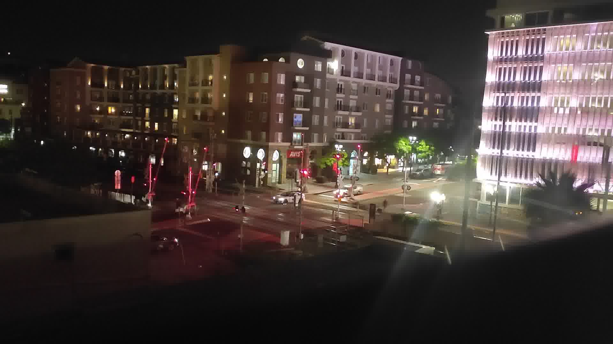

# Example Usage

## Input Files

The output image from this example (shown later) was produced from a 31-image sequence. For each image, there are 2 cars in the center at varying locations. 3 of these images are shown below.

## Output File

The output image is shown below.

The cars are no longer present in the center of the image.

## Output File with Alignment

Automatic image alignment allows the script to adapt to larger image sequences, where variation in camera position due to movement may be more noticeable. Without alignment, this variation would result in a blurred output image.

The output image below was produced from a 56-image sequence with `remove-objects-aligned.py`.

